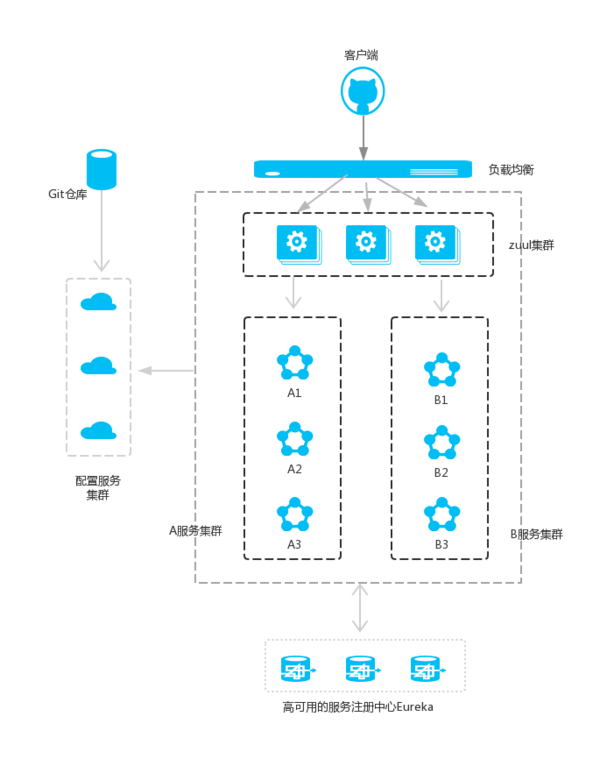

这是我利用业余时间写的 spring cloud的一些例子
----------------------------------------

# 1.spring cloud sevice registor 服务的注册及发现
# 2.spring cloud configuration 实现配置文件的动态加载
  [1]服务的调用者可用动态选择配置git中的文件作为其配置文件
  [2]配置文件实现热加载，当git中的配置被修改后可用通过调用refresh API实现热加载
# 3.spring cloud load balance（负载均衡）
  [1]随机分配响应的server
  [2]服务器集群中当某台server down掉的时候，可以负载到另外可用的server上
# 4.spring cloud Circuit Breaker（断路器）
  [1]当某一个服务不可以的时候，为了防止服务器的频繁访问，当这个服务的访问上线超过设定阀值的时候，熔断器主动阻止这个服务的访问
  [2]熔断器会动态监听down掉服务的心跳，当服务恢复正常的时候会把服务在加入服务队列中
# 5.spring cloud Circuit Break Dashboard(断路器仪表盘)

